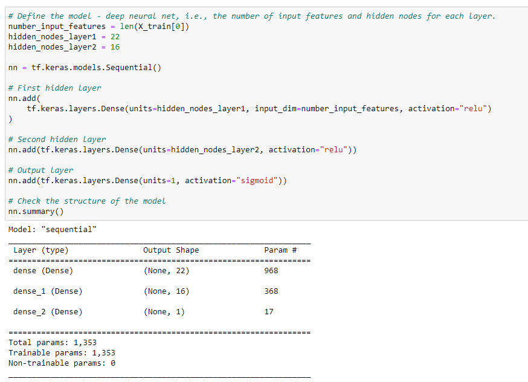

# Neural Network Charity Analysis
## Overview of the Analysis
Deep neural networks were used to help predict where to make investments.  A dataset containing more than 34,000 charity organizations was pre-processed using a binary classifier.  The data was trained, tested and evaluated in order to create an accurate predicting model.  The input data and model parameters were changed several times in order to achieve the highest accuracy.   

## Results
### Data Preprocessing
* What variable(s) are considered the target(s) for your model?
* What variable(s) are considered to be the features for your model?
* What variable(s) are neither targets nor features, and should be removed from the input data?

### Compiling, Training, and Evaluating the Model
* How many neurons, layers, and activation functions did you select for your neural network model, and why?
* Were you able to achieve the target model performance?
* What steps did you take to try and increase model performance?

## Summary

