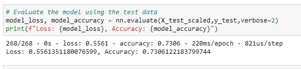

# Neural Network Charity Analysis
## Overview of the Analysis
Deep neural networks were used to help predict where to make investments.  A dataset containing more than 34,000 charity organizations was pre-processed using a binary classifier.  The data was trained, tested and evaluated in order to create an accurate predicting model.  The input data and model parameters were changed several times in order to achieve the highest accuracy.   

## Results
### Data Preprocessing
* The "IS_SUCCESSFUL" column of data was the target of the model.  Ultimately, we want ot predict whether or not the money given to a charity organization is successfully used or not.  
* The features of the model include "STATUS", "ASK_AMT", "APPLICATION_TYPE", "CLASSIFICATION", "USE_CASE", "ORGANIZATION", and "INCOME_AMT".
* The data which was neither a target nor a feature and which was ultimately dropped from the data included: "EIN" and "NAME".  These were identification data and were not relevant to making a prediction.  

### Compiling, Training, and Evaluating the Model
* Given 43 input features and 1 output model, a median amount of nuerons of 22 selected for the first hidden layer.  16 were selected for the second hidden layer.  As a rule of thumb the number of neurons selected should be less than the number of input features and more than the output layer, and a good starting point is the median of the two.  The second hidden layer should have less neurons than the first.  
* The target model performance of 75% was not achieved.   A variety of activation functions and input data options were chosen with the highest achievable accuracy being 73%.  A screenshot of the best model is shown in the screenshot below.  An activation function of ReLU was chosen for the hidden layers and an activation function of sigmoid for the output layer.    

When running the model the highest accuracy of 73% was achieved in a dozen or so epochs.  Hence, the model quickly converges and did not gain any accuracy regardless of the amount of epochs or number of nuerons chosen.  

* In order to increase model performance a variety of changes were implemented to both the model and input features.  In regard to the model, the activation function were the hidden layers were changed from ReLU to Tanh and sigmoid.  In both cases the accuracy was slightly less, around 70%, than the original model.  Different numbers of hidden layers, e.g. hidden layer 1 = 30, hidden layer 2 = 20, were selected to see if this made a difference, but once again the accuracy decreased slightly.  In regard to changing the input features, removing the "SPECIAL_CONSIDERATIONS" and "APPLICATION_TYPE" data columns did not increase the accuracy of the model, with the end result being 70% accuracy.   

## Summary
A deep neural network was used to predict which charity organization are most likely to end in a successful outcome.  A model employing a ReLU activation function in the hidden layers and a sigmoid activation function in the output layer yielded the most accurate result of 73%.  Modifying the input data and model parameters did not increase the accuracy and in all permutations the accuracy stayed around 70%.  
